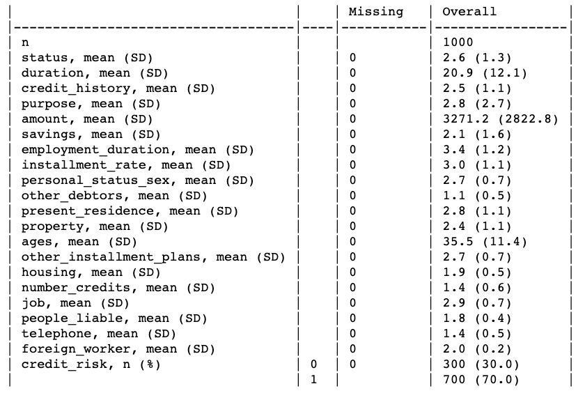
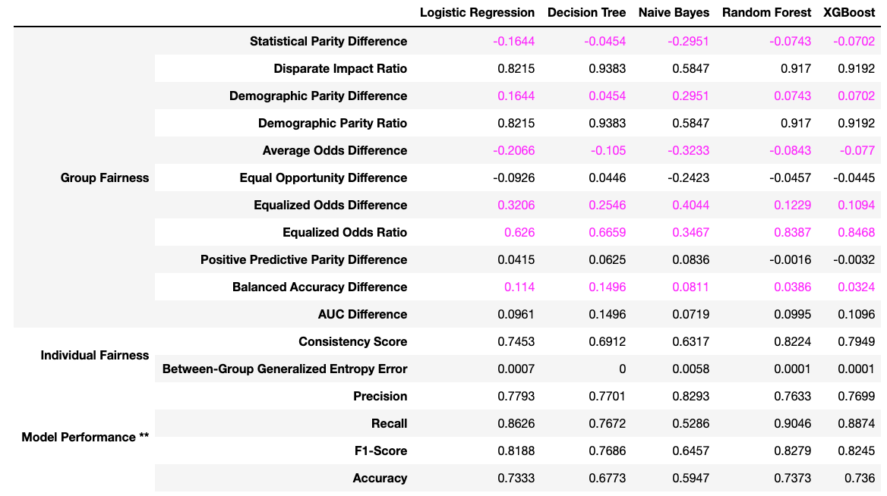
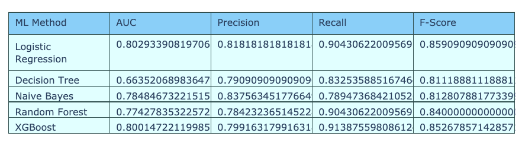

Name: Deline Zent
Date: 12/12/20

Description:
In this project, I have utilized multiple sklearn machine learning models to analyze the South German Credit Dataset then compared their performance metrics including their AUC, precision, recall, F-score, and fairness as determined by the Fair ML Health library. After comparing their metrics to their fairness, I have written a short paper in the Output folder describing the best model to select to prevent bias but still maintain high performing machine-learning models. Model metrics and fairness are calculated within the jupyter notebook named Deline_Zent_A4.

How to Run:

Step 1: Open Deline_Zent_A4. In cell 3, you will need to put your local file path for the fair ml health library into the 4th line. This is the only interaction you will need with this notebook. Make the path to the main folder contained within the input folder, The Fair ML Health Library Master folder.

Step 2: Press run all.

Images of Project

Data Analysis of Different Features in the German Credit Dataset Using a TableOne.

Fairness Evaluation of single woman compared to other people (divorced women/men, single men, widowed women/men).

Comparison of different sklearn model performance metrics.

